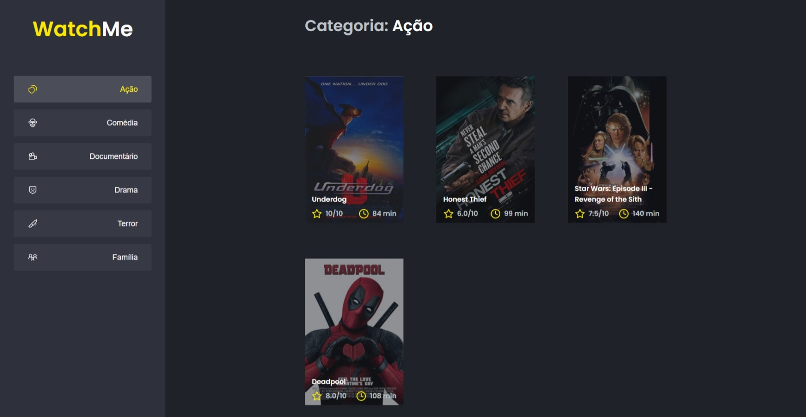

<h1 align="center">WatchMe</h1>

## 📃 Resumo
Este desafio tem como objetivo dividir uma aplicação em componentes afim de isolar as responsabilidades e facilitar a manutenção do código.

## 👀 Exigências
- [x] Criar o componente Content;
- [x] Criar o componente SideBar.

## 🚀 Milha Extra
- [x] Criar um contexto para os gêneros;
- [x] Criar o componente Header.

## 💻 Aplicação

